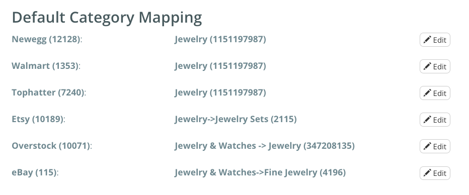
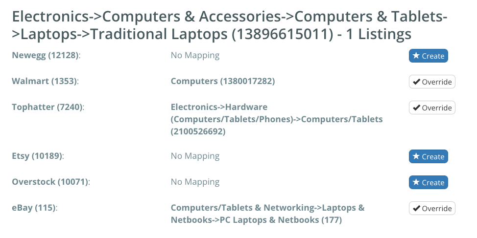

# Getting Started: Category Mapping
### Learn how to map your categories before creating or mirroring your listings

Categories are an important piece of the puzzle when it comes to customers finding your products. We understand that every marketplace has their own categories, and do our best to solve that issue by allowing you to map Amazon categories to other markets. When you create your account, Listing Mirror will do this automatically, but in situations where you want control over that, you can do so manually. [Learn more](https://support.listingmirror.com/hc/en-us/articles/360012837672)

Please note, category mapping will only apply to newly created listings. They will not change your current listing's categories. 

## Default Category Mapping

The first option you'll see on the **Category Mapping** page, is the **Default Category Mapping** selection. You would set these if you want all of your listings for a given marketplace to be mapped to one specific category. Non-default mapping will overwrite anything you assign to the defaults. 

As an example, if you sell mostly jewelry, you could find a jewelry category, and every listing you create moving forward will be mapped to jewelry. 

Here's what that could look like:

## Amazon To Marketplace Specific Mapping

Following the defaults, you'll come to the category specifics. We'll display every category you have imported from Amazon, as to not overwhelm you with all of the categories Amazon provides. 

As an example, let's say you're selling a laptop. Listing Mirror will pre-select certain categories given the intiial Amazon category. If you aren't happy with these choices, you can override the selection, and select what you want instead. 

***

Continued learning: [Getting Started: Mirror From Amazon to eBay](amazon-to-ebay)

Confused? [Contact support!](https://support.listingmirror.com/hc/en-us/articles/360057441252)